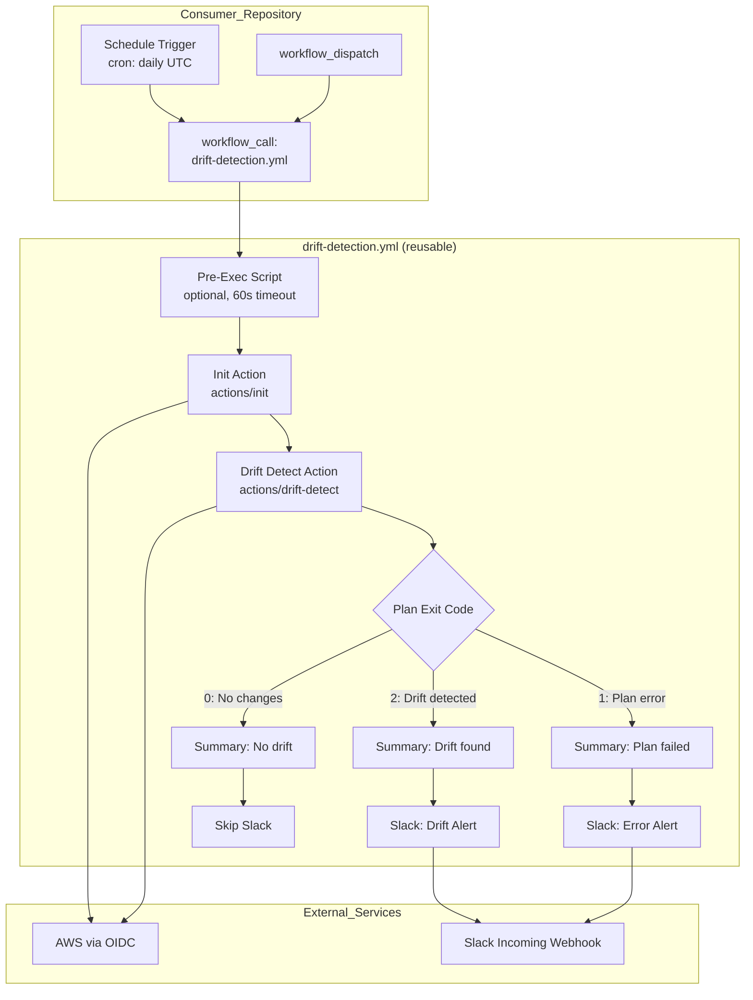
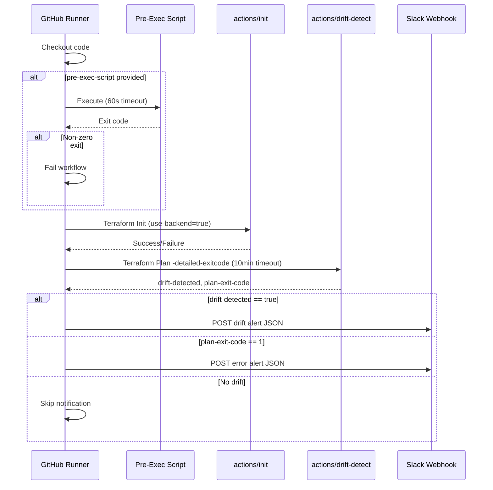
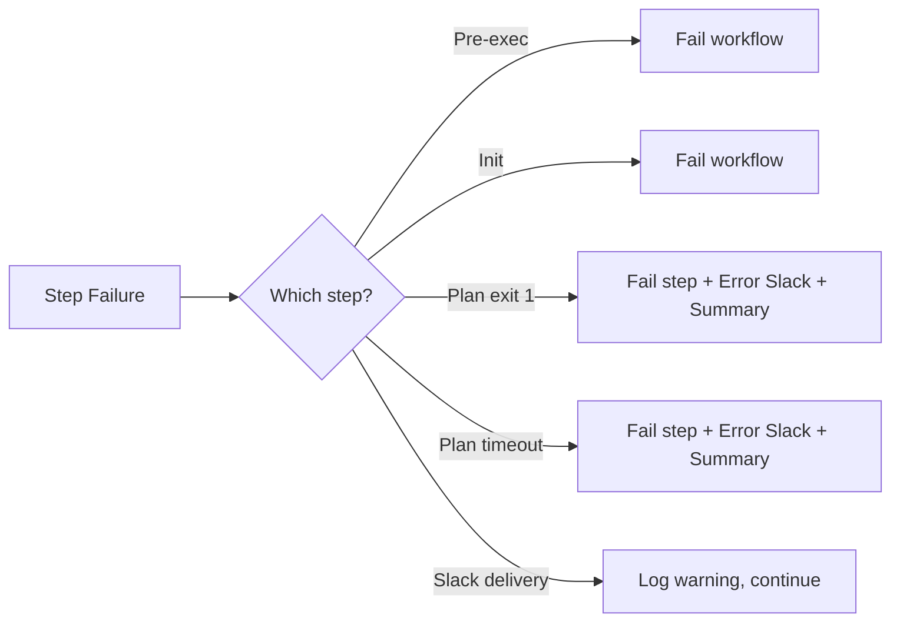

# Design Document: Terraform Drift Detection

## Overview

This design introduces a reusable GitHub Actions workflow and supporting composite action for detecting Terraform infrastructure drift. The solution follows the same architectural patterns established by the existing `standard-pipeline.yml` — a reusable `workflow_call` workflow that delegates to composite actions for discrete operations.

The feature consists of two primary deliverables:

1. **`actions/drift-detect/action.yaml`** — A composite action that runs `terraform plan -detailed-exitcode`, interprets exit codes, sets output variables, and writes a GitHub Actions step summary.
2. **`.github/workflows/drift-detection.yml`** — A reusable workflow that orchestrates pre-execution scripts, Terraform initialisation (via the existing `init` action), drift detection (via the new composite action), and Slack notification.

Consumer repositories define a `schedule` cron trigger in their own workflow file and call the reusable workflow via `workflow_call`, keeping all scheduling decisions local to the consumer while drift detection logic remains centralised.

## Architecture



### Design Decisions

| Decision | Choice | Rationale |
|----------|--------|-----------|
| Separate composite action for drift detection | `actions/drift-detect/action.yaml` | Follows existing pattern (init, plan, apply are all separate actions). Allows the action to be reused independently of the workflow. |
| Slack notification in workflow, not in composite action | Inline step in `drift-detection.yml` | Slack is a workflow-level concern (needs secrets). Keeping it in the workflow avoids coupling the drift-detect action to a specific notification channel. |
| Consumer owns the schedule trigger | Consumer defines `on: schedule` | Different teams have different maintenance windows. The reusable workflow cannot define its own schedule since `workflow_call` workflows are triggered by callers. |
| Incoming webhook URL via `curl` | POST JSON payload to `drift_detection_webhook_url` secret | Simpler than bot token/OAuth — no app installation, no `chat:write` scope, no channel ID input needed. The webhook URL targets a fixed channel configured in Slack. Supports Block Kit payloads for rich formatting. |
| 10-minute timeout on plan step | `timeout-minutes: 10` on the step | Prevents hung plan operations from consuming runner time indefinitely. Matches Requirement 4.7. |
| Summary written by composite action | `$GITHUB_STEP_SUMMARY` written in `actions/drift-detect` | The composite action already knows the exit code and context. Writing summary there avoids duplicating logic in the workflow. |

## Components and Interfaces

### Component 1: Drift Detect Composite Action (`actions/drift-detect/action.yaml`)

**Purpose:** Executes `terraform plan -detailed-exitcode`, interprets the exit code, sets outputs, and writes the GitHub Actions step summary.

**Inputs:**

| Input | Required | Default | Description |
|-------|----------|---------|-------------|
| `working-directory` | No | `.` | Directory containing Terraform configuration |
| `tfvars-file` | No | `""` | Optional path to a `.tfvars` file |
| `github-environment` | No | `placeholder` | Environment name for summary output |

**Outputs:**

| Output | Description |
|--------|-------------|
| `drift-detected` | `true` if exit code is 2, `false` if exit code is 0 |
| `plan-exit-code` | Raw exit code: `0`, `1`, or `2` |

**Behaviour:**

```yaml
runs:
  using: composite
  steps:
    - name: Validate tfvars file
      if: ${{ inputs.tfvars-file != '' }}
      shell: bash
      working-directory: ${{ inputs.working-directory }}
      run: |
        if [ ! -f "${{ inputs.tfvars-file }}" ]; then
          echo "::error::Variable file '${{ inputs.tfvars-file }}' not found"
          exit 1
        fi

    - name: Terraform Plan (Drift Detection)
      id: plan
      shell: bash
      working-directory: ${{ inputs.working-directory }}
      run: |
        set +e
        if [ -n "${{ inputs.tfvars-file }}" ]; then
          terraform plan -detailed-exitcode -input=false -var-file="${{ inputs.tfvars-file }}"
        else
          terraform plan -detailed-exitcode -input=false
        fi
        EXIT_CODE=$?
        set -e

        echo "plan-exit-code=$EXIT_CODE" >> $GITHUB_OUTPUT

        if [ $EXIT_CODE -eq 0 ]; then
          echo "drift-detected=false" >> $GITHUB_OUTPUT
        elif [ $EXIT_CODE -eq 2 ]; then
          echo "drift-detected=true" >> $GITHUB_OUTPUT
        else
          echo "drift-detected=false" >> $GITHUB_OUTPUT
          exit 1
        fi

    - name: Write Step Summary
      if: always()
      shell: bash
      env:
        EXIT_CODE: ${{ steps.plan.outputs.plan-exit-code }}
        ENVIRONMENT: ${{ inputs.github-environment }}
        WORKING_DIR: ${{ inputs.working-directory }}
      run: |
        REPO="${GITHUB_REPOSITORY}"
        if [ "$EXIT_CODE" == "2" ]; then
          echo "## :warning: Drift Detected" >> $GITHUB_STEP_SUMMARY
          echo "" >> $GITHUB_STEP_SUMMARY
          echo "| Field | Value |" >> $GITHUB_STEP_SUMMARY
          echo "|-------|-------|" >> $GITHUB_STEP_SUMMARY
          echo "| Repository | \`$REPO\` |" >> $GITHUB_STEP_SUMMARY
          echo "| Environment | \`$ENVIRONMENT\` |" >> $GITHUB_STEP_SUMMARY
          echo "| Working Directory | \`$WORKING_DIR\` |" >> $GITHUB_STEP_SUMMARY
        elif [ "$EXIT_CODE" == "0" ]; then
          echo "## :white_check_mark: No Drift Detected" >> $GITHUB_STEP_SUMMARY
          echo "" >> $GITHUB_STEP_SUMMARY
          echo "| Field | Value |" >> $GITHUB_STEP_SUMMARY
          echo "|-------|-------|" >> $GITHUB_STEP_SUMMARY
          echo "| Repository | \`$REPO\` |" >> $GITHUB_STEP_SUMMARY
          echo "| Environment | \`$ENVIRONMENT\` |" >> $GITHUB_STEP_SUMMARY
        else
          echo "## :x: Plan Failed" >> $GITHUB_STEP_SUMMARY
          echo "" >> $GITHUB_STEP_SUMMARY
          echo "| Field | Value |" >> $GITHUB_STEP_SUMMARY
          echo "|-------|-------|" >> $GITHUB_STEP_SUMMARY
          echo "| Repository | \`$REPO\` |" >> $GITHUB_STEP_SUMMARY
          echo "| Environment | \`$ENVIRONMENT\` |" >> $GITHUB_STEP_SUMMARY
          echo "| Working Directory | \`$WORKING_DIR\` |" >> $GITHUB_STEP_SUMMARY
        fi
```

### Component 2: Drift Detection Reusable Workflow (`.github/workflows/drift-detection.yml`)

**Purpose:** Orchestrates the full drift detection pipeline — pre-exec, init, plan, notification.

**Triggers:**

```yaml
on:
  workflow_call:
    inputs: { ... }   # See Data Models
    secrets: { ... }
  workflow_dispatch:
    inputs: { ... }   # Same inputs as workflow_call
```

**Job Structure:** Single job (`drift-detection`) running on `ubuntu-latest` with `id-token: write` permission.

**Step Sequence:**



### Component 3: Slack Notification Steps

**Purpose:** Sends a Block Kit message to a fixed Slack channel (configured in the webhook) when drift or errors are detected.

**Implementation:** Uses `curl` to POST a JSON payload to the incoming webhook URL provided by the `drift_detection_webhook_url` secret. The channel is baked into the webhook configuration in Slack — no channel ID input is needed.

**Drift Alert Message Structure:**

```yaml
- name: Notify Slack - Drift Detected
  if: ${{ steps.drift-detect.outputs.drift-detected == 'true' }}
  continue-on-error: true
  shell: bash
  env:
    WEBHOOK_URL: ${{ secrets.drift_detection_webhook_url }}
  run: |
    curl -X POST -H 'Content-type: application/json' \
      --fail-with-body \
      -d '{
        "blocks": [
          {
            "type": "header",
            "text": {
              "type": "plain_text",
              "text": ":warning: Terraform Drift Detected"
            }
          },
          {
            "type": "section",
            "fields": [
              { "type": "mrkdwn", "text": "*Repository:*\n${{ github.repository }}" },
              { "type": "mrkdwn", "text": "*Environment:*\n${{ inputs.github-environment }}" },
              { "type": "mrkdwn", "text": "*Working Directory:*\n${{ inputs.working-directory }}" },
              { "type": "mrkdwn", "text": "*Workflow Run:*\n<${{ github.server_url }}/${{ github.repository }}/actions/runs/${{ github.run_id }}|View Run>" }
            ]
          }
        ]
      }' \
      "$WEBHOOK_URL"
```

**Error Alert Message Structure (exit code 1):**

```yaml
- name: Notify Slack - Plan Error
  if: ${{ steps.drift-detect.outputs.plan-exit-code == '1' }}
  continue-on-error: true
  shell: bash
  env:
    WEBHOOK_URL: ${{ secrets.drift_detection_webhook_url }}
  run: |
    curl -X POST -H 'Content-type: application/json' \
      --fail-with-body \
      -d '{
        "blocks": [
          {
            "type": "header",
            "text": {
              "type": "plain_text",
              "text": ":x: Terraform Plan Failed"
            }
          },
          {
            "type": "section",
            "fields": [
              { "type": "mrkdwn", "text": "*Repository:*\n${{ github.repository }}" },
              { "type": "mrkdwn", "text": "*Environment:*\n${{ inputs.github-environment }}" },
              { "type": "mrkdwn", "text": "*Workflow Run:*\n<${{ github.server_url }}/${{ github.repository }}/actions/runs/${{ github.run_id }}|View Run>" }
            ]
          }
        ]
      }' \
      "$WEBHOOK_URL"
```

### Component 4: Consumer Repository Integration

Consumer repositories call the reusable workflow by defining their own trigger (schedule + dispatch) and passing configuration:

```yaml
# Example: .github/workflows/drift-detection.yml in consumer repo
name: Terraform Drift Detection

on:
  schedule:
    - cron: "0 6 * * *"  # Daily at 06:00 UTC
  workflow_dispatch:

jobs:
  drift-check:
    uses: Home-Office-Digital/core-cloud-workflow-terraform-actions/.github/workflows/drift-detection.yml@main
    with:
      aws-region: eu-west-2
      github-environment: production
      role-to-assume: GitHubActionsRole
      state-bucket: my-terraform-state-bucket
      state-dynamodb-table: my-terraform-lock-table
      state-key: terraform.tfstate
      working-directory: "."
    secrets:
      account_id: ${{ secrets.ACCOUNT_ID }}
      drift_detection_webhook_url: ${{ secrets.DRIFT_DETECTION_WEBHOOK_URL }}
```

## Data Models

### Workflow Inputs Schema

| Input | Type | Required | Default | Description |
|-------|------|----------|---------|-------------|
| `aws-region` | string | No | `eu-west-2` | AWS region for state bucket and resources |
| `github-environment` | string | No | `placeholder` | GitHub environment name |
| `role-to-assume` | string | Yes | — | AWS IAM role name for OIDC |
| `state-bucket` | string | Yes | — | S3 bucket name for Terraform state |
| `state-dynamodb-table` | string | No | `""` | DynamoDB table for state locking |
| `state-key` | string | No | `terraform.tfstate` | State file key in S3 |
| `terraform-version` | string | No | `~1.7.0` | Terraform version to install |
| `working-directory` | string | No | `.` | Directory containing `main.tf` |
| `tfvars-file` | string | No | `""` | Optional `.tfvars` file path |
| `pre-exec-script` | string | No | `""` | Optional shell script to run before Terraform |

### Workflow Secrets Schema

| Secret | Required | Description |
|--------|----------|-------------|
| `account_id` | Yes | AWS account ID for OIDC role ARN construction |
| `drift_detection_webhook_url` | Yes | Slack incoming webhook URL for drift/error notifications |
| `git_auth_token` | No | GitHub PAT for private module access during pre-exec |

### Drift Detect Action Outputs

| Output | Type | Values | Description |
|--------|------|--------|-------------|
| `drift-detected` | string | `true` / `false` | Whether drift was detected |
| `plan-exit-code` | string | `0` / `1` / `2` | Raw terraform plan exit code |

### Step Summary Content Model

| Exit Code | Summary Title | Fields Included |
|-----------|---------------|-----------------|
| 0 | No Drift Detected | Repository, Environment |
| 1 | Plan Failed | Repository, Environment, Working Directory |
| 2 | Drift Detected | Repository, Environment, Working Directory |

## Error Handling

### Failure Modes and Recovery

| Failure | Handling | Requirement |
|---------|----------|-------------|
| OIDC authentication failure | Init action fails, workflow terminates with error in step summary | Req 2.4 |
| Terraform init failure | Init action fails, workflow terminates with error in step summary | Req 3.3 |
| `tfvars-file` not found | Drift-detect action validates file existence before plan, fails with descriptive error | Req 4.6 |
| `terraform plan` returns exit code 1 | Drift-detect action marks step as failed, writes error summary, workflow sends error Slack notification | Req 4.3 |
| `terraform plan` exceeds 10 minutes | Step `timeout-minutes: 10` terminates the process, step is marked as failed | Req 4.7 |
| Pre-exec script fails (non-zero exit) | Workflow terminates before init, reports pre-exec failure | Req 7.3 |
| Pre-exec script exceeds 60 seconds | `timeout-minutes: 1` terminates script, workflow reports timeout | Req 7.4 |
| Slack message delivery failure | `continue-on-error: true` on webhook notification steps ensures workflow does not fail; `curl` failure is logged | Req 5.5 |
| Required inputs missing | GitHub Actions enforces `required: true` at `workflow_call` level; workflow will not start without them | Req 6.3 |

### Error Propagation Strategy



The Slack notification steps use `continue-on-error: true` to ensure a Slack webhook outage does not mask the drift detection result. The workflow run status reflects only the Terraform operations.

## Testing Strategy

### Why Property-Based Testing Does Not Apply

This feature consists entirely of GitHub Actions workflow YAML and shell scripts that orchestrate external services (AWS, Terraform CLI, Slack incoming webhooks). There are no pure functions with varied input spaces to exercise. The behaviour is deterministic configuration — either the workflow is wired correctly or it is not. Property-based testing is inappropriate here because:

- The feature is Infrastructure as Code (GitHub Actions YAML configuration)
- Operations are side-effect-only (calling AWS, running CLI tools, posting to Slack)
- Behaviour does not vary meaningfully across a generatable input space
- Testing requires real or mocked external services, not randomised inputs

### Recommended Testing Approach

**1. YAML Lint and Schema Validation**
- Validate `action.yaml` and `drift-detection.yml` against GitHub Actions schema
- Tool: `actionlint` for static analysis of workflow files
- Run as part of CI on this repository

**2. Unit Tests for Shell Logic (actions/drift-detect)**
- Use a shell testing framework (e.g., `bats-core`) to test the exit code handling script in isolation
- Test cases:
  - Mock `terraform plan` returning exit code 0 → verify outputs are `drift-detected=false`, `plan-exit-code=0`
  - Mock `terraform plan` returning exit code 1 → verify step fails, outputs `plan-exit-code=1`
  - Mock `terraform plan` returning exit code 2 → verify outputs are `drift-detected=true`, `plan-exit-code=2`
  - Provided `tfvars-file` does not exist → verify error message and exit 1
  - Provided `tfvars-file` exists → verify `-var-file` flag is passed

**3. Integration Tests (act or real workflow runs)**
- Use [`nektos/act`](https://github.com/nektos/act) for local workflow execution testing where feasible
- Test the full workflow with mocked AWS credentials and a minimal Terraform configuration
- Verify:
  - Pre-exec script runs and respects timeout
  - Init action is invoked with correct parameters
  - Drift-detect action outputs propagate to Slack notification conditions
  - Summary is written for each exit code scenario

**4. Manual End-to-End Validation**
- Deploy the workflow in a test consumer repository
- Create a known drift scenario (manual AWS change) and verify:
  - Scheduled run detects drift
  - Slack notification arrives with correct content
  - GitHub Actions summary displays correctly
- Test `workflow_dispatch` trigger with custom inputs

**5. Acceptance Criteria Verification Matrix**

| Requirement | Test Type | Verification Method |
|-------------|-----------|---------------------|
| 1.1 Schedule trigger | Manual | Consumer repo cron executes workflow |
| 1.2 workflow_dispatch | Manual | Trigger via GitHub UI with inputs |
| 1.3 workflow_call | Integration | Consumer repo calls reusable workflow |
| 2.1-2.3 OIDC auth | Integration | Init action authenticates successfully |
| 2.4 Auth failure | Integration | Invalid role → workflow fails with summary |
| 3.1-3.4 Init | Integration | Terraform initialises with remote backend |
| 4.1-4.4 Plan exit codes | Unit (bats) | Mock terraform, verify outputs per exit code |
| 4.5 tfvars-file | Unit (bats) | Verify `-var-file` flag passed when set |
| 4.6 Missing tfvars | Unit (bats) | Verify error when file missing |
| 4.7 Plan timeout | Integration | `timeout-minutes` terminates long plan |
| 5.1-5.5 Slack messages | Integration/Manual | Verify messages arrive with correct content |
| 5.6 Slack failure | Integration | Mock Slack failure, verify workflow continues |
| 6.1-6.3 Inputs/secrets | Schema/actionlint | Validate required fields, defaults |
| 7.1-7.4 Pre-exec | Unit/Integration | Script runs, timeout works, failure propagates |
| 8.1-8.4 Summary | Unit (bats) | Verify `$GITHUB_STEP_SUMMARY` output per scenario |
